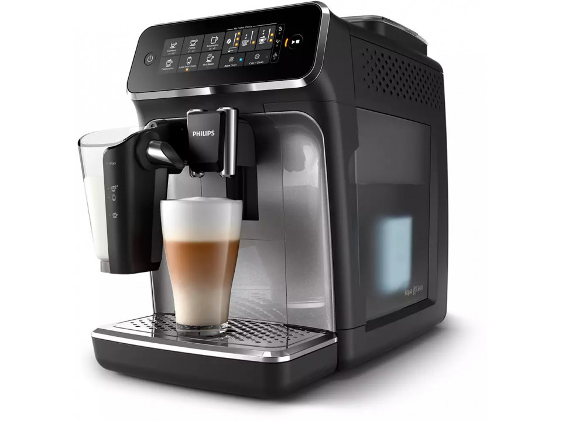

# Lecture 16, Coffee Machine Emulator HW

## Implemented
A reservoir with coffee beans has been implemented, as well as the ability 
to set the strength of coffee (working on the principle of statics for all 
types of coffee).
The enum class CoffeeMachineState has been redesigned into 
the base class CoffeeMachineState from which other states come.
Also the need to clean the coffee machine after n-number of uses.

## Links
Див. [Markdown Live Preview](https://markdownlivepreview.com/) для швидкого ознайомлення з форматом MD для зручного написання документацій з форматуванням на гітхабі

